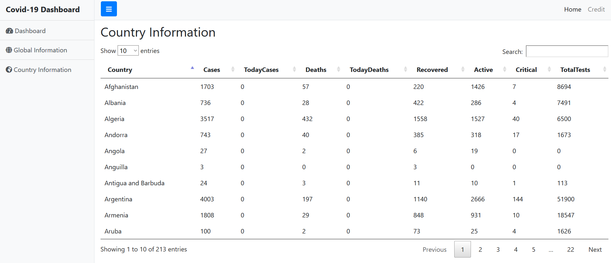
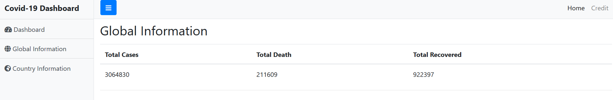

# Covid19-Overview-Dashboard
Covid19 overview dashboard that displays the global &amp; country information regarding the total number of cases, death and recovered using API

# API Author and Credit
 Javier Aviles: https://github.com/javieraviles/covidAPI

# Interested user
There are still few features that need to be completed please redirect yourself to the project requirements for the contribution.  
https://github.com/Rajangrg/Covid19-Overview-Dashboard/projects/1

# project Outcome

